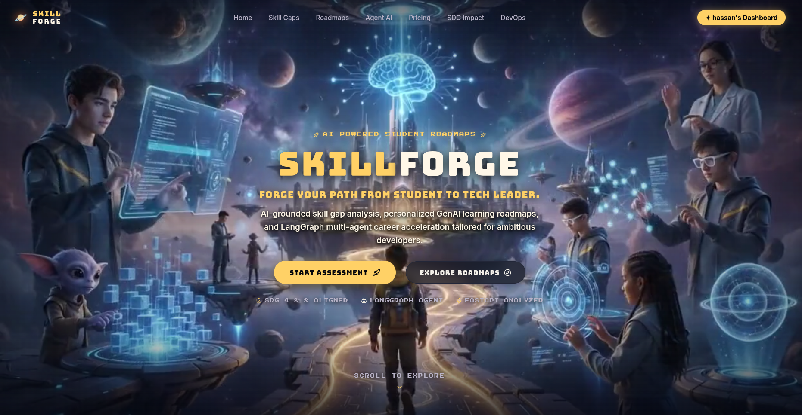
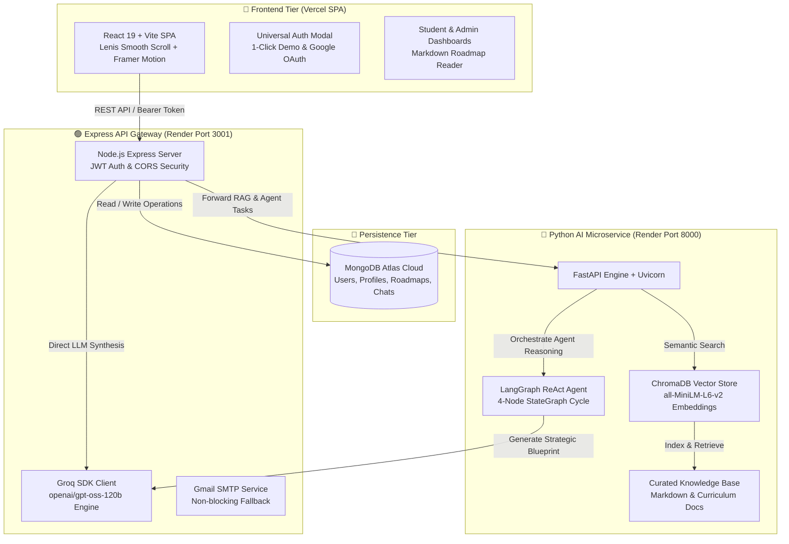
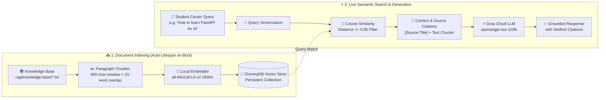

<div align="center">

# 🪐 SKILLFORGE
### *Autonomous AI-Grounded Career Acceleration & Diagnostic Intelligence Platform*

[-FFD166?style=for-the-badge&logo=codeforces&logoColor=05060A)](https://github.com/Hassan136-nust/Skill-Forge-AI-Powered-Career-Development-Platform)
[](https://sdgs.un.org/goals)
[](https://groq.com/)
[](https://www.trychroma.com/)
[](https://vercel.com/)
[](https://render.com/)

<br />



<br />

**Democratizing personalized career pathways, technical competency verification, and AI-grounded learning roadmaps for next-generation engineers.**

[🚀 Live Demo](https://skillforge-app.vercel.app) • [📖 Documentation](#-architecture--data-flow) • [🐍 Python Microservice](#-python-fastapi-ai-microservice) • [🛠️ Setup Guide](#-installation--local-setup)

</div>

---

## 🌟 Interactive Scholar Characters & Avatars

<div align="center">
<table>
  <tr>
    <td align="center" width="25%">
      <br />
      <b>⚡ AI Architect</b><br />
      <sub>Autonomous Planning & Neural Systems</sub>
    </td>
    <td align="center" width="25%">
      <br />
      <b>🐱 Cyber Guardian</b><br />
      <sub>Zero-Trust & Security Protocols</sub>
    </td>
    <td align="center" width="25%">
      <br />
      <b>🌐 Full-Stack Lead</b><br />
      <sub>Distributed Cloud & Scalable Systems</sub>
    </td>
    <td align="center" width="25%">
      <br />
      <b>📊 Data Strategist</b><br />
      <sub>Vector Pipelines & ML Ops</sub>
    </td>
  </tr>
</table>
</div>

---

## 🧭 Overview & Mission

University students and self-taught developers face **three critical bottlenecks** in tech career acceleration:
1. **The Abstract Guidance Trap**: Generic tutorials without verified assessment of existing strengths and weaknesses.
2. **Hallucinated Recommendations**: Standard LLMs give outdated or non-grounded curricula without verifiable sources.
3. **Fragmented Growth Tracking**: No centralized intelligence platform bridging verified assessments, dynamic milestone roadmaps, and real-time mentor guidance.

**SkillForge** solves this through a **Hybrid Multi-Tier AI Architecture** combining **FastAPI Microservices**, **ChromaDB Vector Embeddings**, **Groq Cloud Ultra-Low Latency LLMs (`openai/gpt-oss-120b`)**, and **LangGraph 4-Node Autonomous Planning**.

---

## 🏗️ Architecture & Data Flow



---

## 🔍 ChromaDB Semantic RAG Retrieval Pipeline

SkillForge features an offline-to-online **Retrieval-Augmented Generation (RAG)** pipeline powered by ChromaDB vector similarity and local sentence embeddings:



---

## 🧠 LangGraph 4-Node Autonomous Planning Cycle

SkillForge executes a deterministic **Multi-Node StateGraph Workflow** where each agent node consumes and transforms the shared state:

```mermaid
stateDiagram-v2
    [*] --> Node1_SkillProfiler: Student Profile & Diagnostic Quiz

    state Node1_SkillProfiler {
        [*] --> IngestScores
        IngestScores --> MatchTargetRole
        MatchTargetRole --> GenerateGapList
        GenerateGapList --> [*]
    }

    Node1_SkillProfiler --> Node2_KnowledgeRetriever: State { gaps, targetRole, scores }

    state Node2_KnowledgeRetriever {
        [*] --> VectorSearch
        VectorSearch --> ExtractCurriculum
        ExtractCurriculum --> AssembleSources
        AssembleSources --> [*]
    }

    Node2_KnowledgeRetriever --> Node3_AgentPlanner: State { gaps, retrievedContext, sources }

    state Node3_AgentPlanner {
        [*] --> Thought
        Thought --> Action_PrioritizeMilestones
        Action_PrioritizeMilestones --> Observation_ResolvePrerequisites
        Observation_ResolvePrerequisites --> [*]
    }

    Node3_AgentPlanner --> Node4_RoadmapSynthesizer: State { structuredPlan, capstoneIdeas }

    state Node4_RoadmapSynthesizer {
        [*] --> FormatMarkdownRoadmap
        FormatMarkdownRoadmap --> GenerateWeeklySprints
        GenerateWeeklySprints --> AssignCapstoneProjects
        AssignCapstoneProjects --> [*]
    }

    Node4_RoadmapSynthesizer --> [*]: Final 4-Stage Autonomous Roadmap & MongoDB Persist
```



---

## ⚡ Key Feature Matrix

| Feature | Description | Technology |
|---|---|---|
| **Autonomous Roadmaps** | 4-Stage visual blueprints with interactive modal readers, milestone tables, and week-by-week sprints | Groq `openai/gpt-oss-120b` + LangGraph |
| **ChromaDB Semantic RAG** | Low-latency grounded AI mentorship with citation badges and curriculum grounding | ChromaDB + ONNX Embeddings |
| **Diagnostic Assessments** | 5-Question adaptive technical quiz to calibrate proficiency and uncover hidden skill gaps | Custom Scoring Matrix |
| **GitHub Auto-Sync** | 1-Click extraction of verified languages, topics, and stars from public developer repositories | GitHub REST v3 API |
| **Admin Command Center** | Real-time platform KPI analytics, student CRM, chat logs inspection, and full roadmap blueprint reader | MongoDB Aggregation Pipelines |
| **Zero-Friction Auth** | Google OAuth, JWT authentication, Gmail SMTP delivery with instant fallback bypass code | Nodemailer + JWT + Google GSI |

---

## 📂 Project Structure

```bash
SkillForge/
├── src/                          # ⚡ React Frontend (Vite)
│   ├── components/
│   │   ├── HeroFrame.jsx         # Futuristic Hero with high-contrast typography
│   │   ├── StudentDashboard.jsx  # Student diagnostic & roadmap terminal
│   │   ├── AdminDashboard.jsx    # Admin Command Center & CRM
│   │   ├── FullRoadmapPage.jsx   # Dedicated deep-dive roadmap page
│   │   ├── AiMentorPage.jsx      # ChromaDB RAG AI Assistant chat interface
│   │   ├── AuthModal.jsx         # 1-Click demo & OTP registration modal
│   │   └── Navbar.jsx            # Cosmic glassmorphism navigation
│   └── config/
│       └── api.js                # Centralized dynamic API endpoints
├── server/                       # 🟢 Express API Gateway
│   ├── server.js                 # Express bootstrap & health routes
│   ├── controllers/              # Auth, Assessment, & Profile controllers
│   ├── models/                   # User, Profile, Roadmap, ChatSession schemas
│   ├── routes/                   # aiRoutes, mentorRoutes, adminRoutes, authRoutes
│   └── config/                   # MongoDB & Nodemailer SMTP mailer
├── python_service/               # 🐍 Python FastAPI AI Engine
│   ├── main.py                   # FastAPI app with auto-indexing lifespan
│   ├── vectorstore.py            # ChromaDB persistent/in-memory vector store
│   ├── agent.py                  # LangGraph 4-Node ReAct Planning Agent
│   ├── skill_analyzer.py         # Diagnostic gap scoring algorithm
│   └── roadmap_generator.py      # Structured curriculum generator
├── rag/
│   └── knowledge-base/           # 📚 Authentic engineering curricula & roadmaps
└── vercel.json                   # SPA catch-all rewrite rules for production
```

---

## 🐧 Linux Shell Automation Suite

SkillForge includes dedicated bash scripts in `scripts/` to bootstrap, run, and audit all microservices in a single command:

| Script | Command | Purpose |
|---|---|---|
| **🚀 One-Command Launcher** | `./scripts/setup.sh` | Installs Python & Node dependencies, seeds `.env`, and launches all 3 tiers with live hot-reload |
| **🔍 Health & Connectivity Audit** | `./scripts/test_services.sh` | Audits Express Gateway (3001), FastAPI Service (8000), and Frontend (5173) connectivity |

```bash
# Make scripts executable
chmod +x scripts/*.sh

# Option A: One-command full-stack boot
./scripts/setup.sh

# Option B: Audit running microservice health
./scripts/test_services.sh
```

---

## 🛠️ Installation & Local Setup

### 1. Prerequisites
- **Node.js**: v18.0+
- **Python**: v3.10+
- **MongoDB**: Local MongoDB instance or free MongoDB Atlas URI
- **Groq API Key**: Free key from [console.groq.com](https://console.groq.com/)

---

### 2. Clone & Environment Configuration

```bash
# Clone the repository
git clone https://github.com/Hassan136-nust/Skill-Forge-AI-Powered-Career-Development-Platform.git
cd Skill-Forge-AI-Powered-Career-Development-Platform

# Create .env file in root
cp .env.example .env
```

Fill in your `.env` variables:
```env
PORT=3001
MONGODB_URI=mongodb+srv://<username>:<password>@cluster0.mongodb.net/skillforge?retryWrites=true&w=majority
JWT_SECRET=skillforge_super_secure_jwt_secret_key_2026
GROQ_API_KEY=gsk_your_groq_api_key_here
PYTHON_SERVICE_URL=http://localhost:8000

```

---

### 3. Launch Services

#### Terminal 1: Node.js Express Gateway
```bash
npm install
npm run server
```
*Express Gateway runs on `http://localhost:3001`*

#### Terminal 2: Python FastAPI & ChromaDB Service
```bash
cd python_service
pip install -r requirements.txt
python -m uvicorn main:app --host 0.0.0.0 --port 8000 --reload
```
*FastAPI microservice runs on `http://localhost:8000` (auto-indexes ChromaDB on boot)*

#### Terminal 3: React + Vite Frontend
```bash
npm run dev
```
*Frontend runs on `http://localhost:5173`*

---

## ⏱️ 24/7 Uptime & Observability

Both microservices expose production-ready health monitoring endpoints for **[UptimeRobot](https://uptimerobot.com/)**:

- **Express Gateway Health**: `GET https://skill-forge-ai-powered-career-9qhf.onrender.com/health`
- **Python AI Service Health**: `GET https://skill-forge-ai-powered-career.onrender.com/health`

```json
{
  "status": "healthy",
  "service": "SkillForge Express Backend Gateway",
  "uptime": "1420s"
}
```

---

## 🎯 LoopLearn Hackathon 2026 (PS-03) Alignment

- **UN SDG 4 (Quality Education)**: Bridges higher education curricula with real-world industry competencies through personalized AI roadmaps and continuous diagnostic calibration.
- **UN SDG 8 (Decent Work & Economic Growth)**: Accelerates graduate employability by identifying technical gaps early and recommending verifiable capstone project deliverables.

---

<div align="center">

**Built with ❤️ for the LoopLearn Hackathon 2026**<br />
*Democratizing AI-Grounded Career Acceleration Across the Universe* 🪐

</div>
