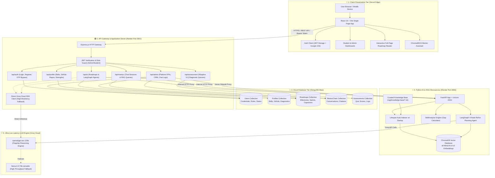
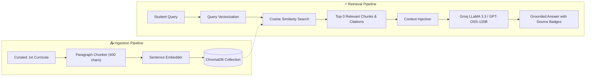

# 🪐 SkillForge — Comprehensive System Architecture Document

## 1. Executive Summary
SkillForge is an autonomous AI-grounded career acceleration and competency intelligence platform designed for the **LoopLearn Hackathon 2026 (PS-03)** and aligned with **UN SDGs 4 & 8**. It implements a decoupled microservices architecture featuring:
- **Client Tier**: React 19 + Vite Single Page Application (SPA) deployed on Vercel Global Edge CDN.
- **API Gateway Tier**: Node.js / Express.js REST API deployed on Render Cloud (Port 3001) managing JWT sessions, schema validation, and routing.
- **AI Microservice Tier**: Python 3.10+ FastAPI service (Port 8000) orchestrating ChromaDB vector embeddings and LangGraph 4-node ReAct workflows.
- **LLM & Inference Tier**: Groq Cloud LPUs executing `openai/gpt-oss-120b` and `llama-3.3-70b-versatile` at ~300 tokens/sec.
- **Persistence Tier**: MongoDB Atlas Cloud multi-node replica set cluster.

---

## 2. End-to-End System Architecture Diagram

---

## 3. ChromaDB Semantic RAG Retrieval Architecture

---

## 4. LangGraph 4-Node Multi-Agent StateGraph

```mermaid
stateDiagram-v2
    [*] --> Node1_SkillProfiler: Diagnostic Assessment Results
    
    state Node1_SkillProfiler {
        [*] --> IngestQuizResults
        IngestQuizResults --> CalibrateSkillMatrix
        CalibrateSkillMatrix --> IdentifyGapList
        IdentifyGapList --> [*]
    }

    Node1_SkillProfiler --> Node2_KnowledgeRetriever: State { gaps, targetGoal, currentScores }

    state Node2_KnowledgeRetriever {
        [*] --> QueryChromaDB
        QueryChromaDB --> ExtractSyllabus
        ExtractSyllabus --> FormatSourceCitations
        FormatSourceCitations --> [*]
    }

    Node2_KnowledgeRetriever --> Node3_AgentPlanner: State { gaps, retrievedContext, sources }

    state Node3_AgentPlanner {
        [*] --> ReAct_Thought
        ReAct_Thought --> ReAct_Action
        ReAct_Action --> ReAct_Observation
        ReAct_Observation --> SequenceMilestones
        SequenceMilestones --> [*]
    }

    Node3_AgentPlanner --> Node4_RoadmapSynthesizer: State { structuredPlan, capstones }

    state Node4_RoadmapSynthesizer {
        [*] --> GenerateMilestoneTable
        GenerateMilestoneTable --> Construct16WeekSprints
        Construct16WeekSprints --> FormulateCapstoneDeliverables
        FormulateCapstoneDeliverables --> [*]
    }

    Node4_RoadmapSynthesizer --> [*]: Final Roadmap Stored in MongoDB & Rendered in SPA
```

