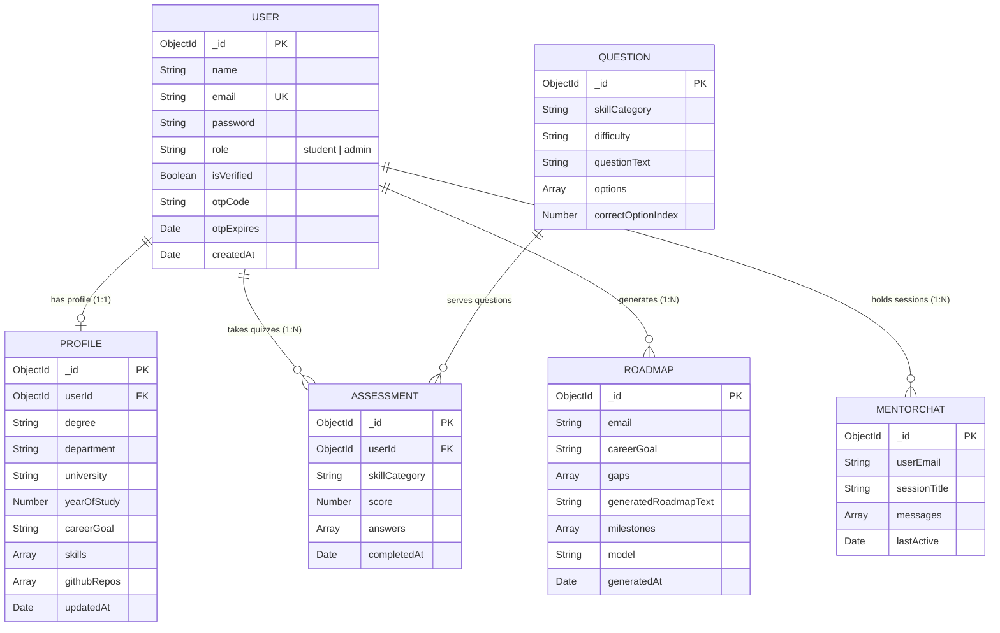

# 🍃 SkillForge — Database & Schema Architecture Explanation

## 1. Database Overview
SkillForge employs a **Dual-Persistence Strategy**:
1. **Primary Operational Database**: **MongoDB Atlas Cloud** (Multi-tenant Document Store) for user entities, profiles, diagnostic assessment logs, roadmaps, and chat history.
2. **Semantic Vector Store**: **ChromaDB** (Cosine Distance Embeddings) for authentic curriculum retrieval-augmented generation (RAG).

---

## 2. Entity-Relationship (ER) Diagram

---

## 3. Detailed MongoDB Collection Schemas

### 3.1 `users` Collection (`models/User.js`)
Stores authentication records, credentials, roles, and verification status.

| Field Name | Type | Constraints | Description |
|---|---|---|---|
| `_id` | `ObjectId` | Primary Key | Unique User ID |
| `name` | `String` | Required, Trimmed | Full name of scholar/admin |
| `email` | `String` | Required, Unique, Lowercase, Indexed | Scholar's academic/work email |
| `password` | `String` | Minlength: 6, `select: false` | Bcrypt salted & hashed password |
| `role` | `String` | Enum: `['student', 'admin']`, Default: `'student'` | RBAC permission role |
| `isVerified` | `Boolean` | Default: `true` | Email security verification state |
| `otpCode` | `String` | Optional, `select: false` | 6-Digit random numeric verification OTP |
| `otpExpires` | `Date` | Optional, `select: false` | 10-Minute expiry timestamp |
| `createdAt` | `Date` | Auto Timestamp | Registration date |

---

### 3.2 `profiles` Collection (`models/Profile.js`)
Maintains technical skills cloud, GitHub synced repositories, degree, and diagnostic metrics.

| Field Name | Type | Description |
|---|---|---|
| `userId` | `ObjectId (ref: User)` | Foreign Key reference to `users` |
| `degree` | `String` | e.g. "BS Computer Science" |
| `university` | `String` | e.g. "NUST SEECS" |
| `yearOfStudy` | `Number` | 1st, 2nd, 3rd, or 4th Year |
| `careerGoal` | `String` | Active target track (e.g. "AI Engineer") |
| `skills` | `Array of Objects` | `[{ name: "Python", level: "advanced", isVerified: true, verifiedScore: 92 }]` |
| `githubRepos` | `Array of Objects` | `[{ title: "Agentic-RAG", techStack: ["Python", "FastAPI"], stars: 14 }]` |

---

### 3.3 `roadmaps` Collection (`models/Roadmap.js`)
Persists generated multi-stage career blueprints, sprint schedules, and capstone milestones.

| Field Name | Type | Description |
|---|---|---|
| `email` | `String (Indexed)` | Associated student email |
| `careerGoal` | `String` | Career target track |
| `gaps` | `Array of Strings` | Missing technical competencies identified |
| `generatedRoadmapText` | `String` | Full structured Markdown output |
| `milestones` | `Array of Objects` | Structured 4-stage milestones `[{ step: "01", title, desc, capstone, tech }]` |
| `model` | `String` | Model engine (`openai/gpt-oss-120b`, `LangGraph 4-Node`) |
| `generatedAt` | `Date` | Generation timestamp |

---

### 3.4 `mentor_chats` Collection (`models/MentorChat.js`)
Persists AI chat sessions, conversation turns, citations, and grounded metadata.

| Field Name | Type | Description |
|---|---|---|
| `userEmail` | `String (Indexed)` | Student email |
| `sessionTitle` | `String` | Auto-titled session headline |
| `messages` | `Array of Objects` | `[{ role: "user"|"assistant", content: "...", citations: [...], timestamp }]` |
| `lastActive` | `Date` | Last conversation activity |

---

## 4. ChromaDB Vector Store Schema (`python_service/vectorstore.py`)

- **Collection Name**: `skillforge_knowledge_base`
- **Distance Metric**: Cosine Similarity (`metadata: { "hnsw:space": "cosine" }`)
- **Embedding Model**: `all-MiniLM-L6-v2` (384-dimensional dense vectors)
- **Document Payload**:
  - `document`: 400-character paragraph text chunk
  - `id`: Unique chunk identifier (`{source}_{fileIndex}_{subIndex}`)
  - `metadata`: `{ "source": "Ai Engineer Roadmap", "file": "ai-engineer-roadmap.txt" }`
